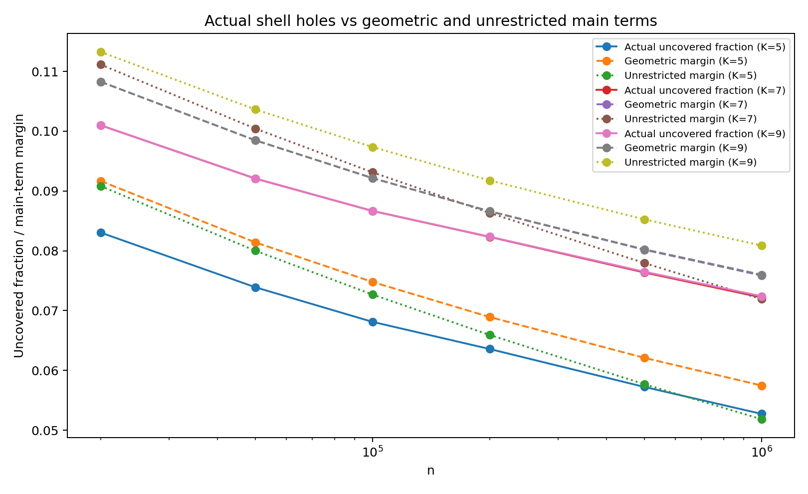
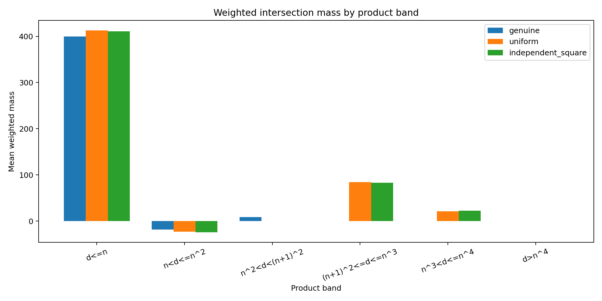

# Multiplication Geometry in Square Shells

Computational experiments on **deterministic multiplication coverage** in the square shell

$$
n^2 < m < (n+1)^2.
$$

This repository contains the code, data, and figures supporting the paper [*Multiplication Geometry in Square Shells: Finite Coverage, Truncated Legendre Sums, and the Parity Barrier*](https://zenodo.org/records/22553217) (Ross, M. M., 2026).

[](https://doi.org/10.5281/zenodo.22541255)

The basic observation is elementary but useful: there are exactly $n$ odd integers in this shell, and every odd composite $m$ has an odd factor at most $n$. Thus multiplication rows alone determine the prime positions in the shell.

Two closely related row systems are used in the repository:

- `multiplication_coverage.py` marks with **every odd row** $3\le a\le n$, using no primality test and no pre-supplied prime list;
- the overlap/certificate calculations use the **irreducible odd rows**, equivalently the odd primes $p\le n$.

In either description, an odd shell position missed by every irreducible row is prime.

> **Status.** The repository contains exact finite-shell computations, exact-prime input calculations, and high-accuracy numerical models. It does **not** prove a new prime-in-short-interval theorem. In particular, the large-$n$ crossing calculations for the product-truncated geometric main terms are numerical experiments. Where a PNT tail is used, primes above a finite cutoff are replaced by the density $dt/\log t$.

## Repository layout

```text
square-shells/
├── README.md
├── LICENSE.md
├── code/
│   ├── cpp/                         C++ exact-prime / exact-shell programs
│   └── *.py                         Python campaign and diagnostic scripts
├── results/                         saved data and crossing calculations
└── figures/                         charts from the investigation
```

## 1. Multiplication depth and the overlap hierarchy

For an odd shell position $m$, let

$$
w(m)=\left\lvert\{p\le n:\ p\text{ is an irreducible odd multiplication row and }p\mid m\}\right\rvert.
$$

Define the collision sums

$$
S_j(n)=\sum_m \binom{w(m)}{j}.
$$

For odd $K$, ordinary Bonferroni gives

$$
U_K=S_1-S_2+S_3-\cdots+S_K,
$$

an upper bound for the number of covered odd positions. Since the shell has exactly $n$ odd positions,

$$
H_K=n-U_K
$$

is a deterministic lower bound on the number of uncovered positions ("certified holes").

The exact number of holes is

$$
H_{\mathrm{exact}} =
\left\lvert\{m:w(m)=0\}\right\rvert,
$$

which is also the exact number of primes in the shell.

The loss from truncating inclusion-exclusion at odd order $K$ is itself exact:

$$
U_K-|C| =
\sum_{w\ge K+1}
\left\lvert\{m:w(m)=w\}\right\rvert
\binom{w-1}{K}.
$$

So the finite-depth error is completely accounted for by high-multiplicity collisions.

## 2. Shifted polynomial majorants

The experiments also use a family of pointwise coverage majorants

$$
P_{K,r}(w) =
1+
\frac{(w-1)\prod_{j=0}^{K-2}(w-r-j)}
     {\prod_{j=0}^{K-2}(r+j)},
\qquad
K\text{ odd},\quad r\ge2.
$$

For integer $w\ge1$,

$$
P_{K,r}(w)\ge1,
$$

while $P_{K,r}(0)=0$. Expanding in the binomial basis,

$$
P_{K,r}(w) =
\sum_{j=1}^K c_j\binom{w}{j},
$$

gives a deterministic coverage bound

$$
L_{K,r} =
\sum_{j=1}^K c_jS_j.
$$

A shell is certified to contain a hole whenever

$$
L_{K,r} < n.
$$

The ordinary Bonferroni bound is $r=2$.

Two low-order majorants found computationally are

$$
L_{3,3} =
S_1-\frac56S_2+\frac12S_3,
$$

and

$$
L_{5,3} =
S_1-\frac{14}{15}S_2+\frac45S_3-\frac35S_4+\frac13S_5.
$$

## 3. Product-truncated geometric main terms

The phase-scramble experiments exposed an arithmetic restriction that is absent from unrestricted inclusion-exclusion models.

If distinct prime rows $p_1,\dots,p_j$ meet at a genuine shell position $m$, then

$$
d=p_1\cdots p_j\mid m<(n+1)^2.
$$

Hence every genuine intersection satisfies

$$
p_1\cdots p_j<(n+1)^2.
$$

This motivates the product-truncated reciprocal-prime sums

$$
E_j(n) =
\sum_{\substack{
3\le p_1 < \cdots < p_j\le n\\
p_1\cdots p_j<(n+1)^2}}
\frac1{p_1\cdots p_j}.
$$

For a majorant with coefficients $c_j$, define the geometric main term

$$
M^{\mathrm{geom}}_{K,r}(n) =
\sum_{j=1}^K c_jE_j(n).
$$

For the quintic shifted majorant,

$$
M^{\mathrm{geom}}_{5,3} =
E_1-\frac{14}{15}E_2+\frac45E_3-\frac35E_4+\frac13E_5.
$$

The corresponding **unrestricted** model replaces $E_j$ by the elementary symmetric reciprocal-prime sums over all distinct $p_i\le n$, without the product cutoff.

Saved fully enumerated/scalable calculations show the effect clearly:

| $n$ | $M^{\mathrm{geom}}_{5,3}$ | unrestricted $M_{5,3}$ | geometric margin $1-M$ | mass removed by cutoff |
|---:|---:|---:|---:|---:|
| $10^6$ | 0.942526 | 0.948153 | 0.057474 | 0.005627 |
| $10^7$ | 0.955703 | 0.965957 | 0.044297 | 0.010254 |
| $10^8$ | 0.967042 | 0.982398 | 0.032958 | 0.015356 |
| $10^9$ | 0.977729 | 0.998350 | 0.022271 | 0.020621 |

At $n=10^{10}$ the saved hybrid calculation gives

$$
M^{\mathrm{geom}}_{5,3}\approx0.988404,
\qquad
M^{\mathrm{unrestricted}}_{5,3}\approx1.014289.
$$

Thus the unrestricted model has already crossed 1 while the product-truncated model retains a positive margin.

## 4. Main finite-shell computations

### Dense scan through $n=10^6$

The shifted-hierarchy scan reached every shell through

$$
n=1{,}000{,}000.
$$

At the endpoint:

| quantity | value |
|---|---:|
| $n$ | 1,000,000 |
| exact holes in the shell | 72,413 |
| maximum multiplication depth | 9 |
| $K=5,r=3$ bound / $n$ | 0.9472664 |
| $K=5,r=3$ certified holes | 52,733.6 |
| $K=7,r=2$ bound / $n$ | 0.927792 |
| $K=7,r=2$ certified holes | 72,208 |
| $K=9,r=2$ bound / $n$ | 0.927587 |
| $K=9,r=2$ certified holes | 72,413 |

Because the maximum depth at this shell is 9, ordinary Bonferroni at $K=9$ is exact.

The stable best shifts at the top of the scan are

$$
(K,r)=(3,4),(5,3),(7,2),(9,2),(11,2).
$$

The cubic $r=3$ certificate first fails at

$$
n=24207.
$$

No failure of $K=5,r=3$ was found through $10^6$; likewise the higher orders used in the scan remain successful.

**Checkpoint caveat.** `results/overnight_hierarchy.checkpoint.json` is marked `"history_complete": false` because the final v3 run was bootstrapped from a v2 scan at $n=247000$. The scan itself completed through $10^6$, but some cumulative pre-resume failure-count and worst-ratio aggregates cannot be reconstructed from the checkpoint alone.

### Exact larger-shell samples

The C++ exact-shell program extends the direct depth/certificate calculation to much larger individual shells:

| $n$ | exact holes | max depth | $L_{5,3}/n$ | $L_{7,2}/n$ | $L_{9,2}/n$ |
|---:|---:|---:|---:|---:|---:|
| $10^7$ | 620,979 | 10 | 0.959521 | 0.938722 | 0.937903 |
| $10^8$ | 5,429,044 | 11 | 0.970476 | 0.947907 | 0.945714 |
| $10^9$ | 48,254,877 | 12 | 0.980975 | 0.956384 | 0.951764 |

These are exact shell calculations: the row depths and the $S_j$ are obtained directly, without the FFT/PNT geometric approximation.

### Local windows at $n=10^6$

For the shell around $10^{12}$, applying the certificates to every contiguous local window gave:

| certificate | shortest uniformly certified window | consecutive integers |
|---|---:|---:|
| $K=5,r=3$ | 391 odd positions | 782 |
| $K=7,r=2$ | 207 odd positions | 414 |
| $K=9,r=2$ | 130 odd positions | 260 |

At $K=9$, the 260-integer threshold coincides with the actual longest prime gap in that shell.

For the $K=5,r=3$, $L=391$ experiment:

- main-term margin: about 20.2723 holes;
- worst passing window: weighted remainder $R\approx19.5390$, leaving a certificate of about 0.7333;
- the adjacent $L=390$ case fails narrowly, with $R\approx20.3538$ against a main margin of about 20.2205.

## 5. Parity-like cancellation and phase controls

`parity_diagnostic.py` decomposes the local remainder by collision order.

For a median 391-position window at $n=10^6$,

$$
R\approx-0.2610,
$$

but this small net value comes from large cancellation:

$$
R_{\text{odd }j}\approx+48.953,
\qquad
R_{\text{even }j}\approx-49.214.
$$

For the worst passing 391-position window,

$$
R\approx19.539,
$$

with

$$
R_{\text{odd }j}\approx21.419,
\qquad
R_{\text{even }j}\approx-1.880.
$$

This was the first strong indication that dangerous local windows arise when the usual odd/even cancellation weakens.

### Phase-scramble controls

`phase_scramble_test_v2.py` compares three row systems:

1. **genuine** — the actual square-shell phase vector;
2. **uniform** — independent uniform phases modulo each prime;
3. **independent_square** — correct quadratic-residue marginal at each prime, but with the common square anchor destroyed.

At $n=10^6$, $K=5,r=3$, $L=391$:

- genuine square shell: `max R = 19.538984`, with no failing window;
- 100 uniform scrambles: mean `max R ≈ 125.1`, all fail somewhere;
- 100 independent-square scrambles: mean `max R ≈ 121.9`, all fail somewhere.

In a 41-shell genuine ensemble from $n=995000$ to $1005000$, the typical maximum remainder remains near 19; 7 of 41 shells fail at the fixed test length $L=391$.

### High-product collision test

`high_product_collision_test.py` measures weighted intersection mass by product range. In the saved 100-trial experiment:

- genuine shell: weighted mass from $d\ge(n+1)^2$ is exactly 0;
- uniform scrambles: mean impossible-product mass is about 105.86;
- independent-square scrambles: mean impossible-product mass is about 106.28.

For the genuine worst window:

| product range | weighted actual intersection mass |
|---|---:|
| $d\le n$ | +399.8 |
| $n < d\le n^2$ | -18.1333 |
| $n^2 < d < (n+1)^2$ | +8.6 |
| $d\ge(n+1)^2$ | 0 |

This experiment led directly to the product-truncated geometric main term.

## 6. Large-$n$ geometric crossing experiments

The scalable and hybrid scripts ask where a geometric main term reaches 1.

These are **model crossings**, not theorem thresholds.

### $K=5$, $r=3$

The fully enumerated `geometric_k5_scalable.py` calculation is practical through about $10^9$ on ordinary hardware. For much larger $n$, `geometric_k5_hybrid.py` keeps primes exact to a user-chosen cutoff and replaces the remaining prime measure by $dt/\log t$.

The multi-cutoff, three-grid precision run places the hybrid crossing near

$$
n\approx1.1286\times10^{11}.
$$

The C++ exact-prime stream then removes the PNT-tail approximation. With every odd prime streamed exactly, the saved three-grid calculations give

$$
M^{\mathrm{geom}}_{5,3}(112{,}860{,}000{,}000)
\approx0.999999895,
$$

and

$$
M^{\mathrm{geom}}_{5,3}(112{,}870{,}000{,}000)
\approx1.000000327.
$$

A simple interpolation of those two saved values puts the crossing near

$$
n\approx112{,}862{,}431{,}300.
$$

This is an **exact-prime-input** check, but it is still not an exact evaluation of the product cutoff: the logarithmic histogram remains finite and is extrapolated in grid size.

### $K=7$, $r=2$

For the ordinary seventh-order geometric Bonferroni main term

$$
M^{\mathrm{geom}}_{7,2} =
E_1-E_2+E_3-E_4+E_5-E_6+E_7,
$$

the saved hybrid precision calculations place the crossing near

$$
n\approx4.0015\times10^{13}.
$$

### $K=9$, $r=2$

For

$$
M^{\mathrm{geom}}_{9,2} =
E_1-E_2+E_3-E_4+E_5-E_6+E_7-E_8+E_9,
$$

the highest-grid saved run places the hybrid crossing near

$$
n\approx3.2258\times10^{25}.
$$

The dramatic movement of the numerical crossing as $K$ increases is one of the main computational observations of the later campaign. It should not be read as a proof that the corresponding finite-shell certificate succeeds uniformly up to those scales.

## 7. Liouville-parity and $q=1$ diagnostics

### `code/liouville_parity_diagnostic.py`

For an initial odd window $J$ of a square shell, this script forms a dyadic Liouville decomposition

$$
T(D) =
\sum_{\substack{D\le d<2D\\P^+(d)\le n}}
\mu(d)^2
\sum_{q:\,dq\in J}\lambda(q).
$$

Its exact checksum is

$$
\sum_D T(D)=-H(J),
$$

where $H(J)$ is the number of uncovered prime positions in $J$.

The default experiment uses $n=10^6$ and

$$
Y=\left\lfloor (n^2)^{4/9}\right\rfloor.
$$

The saved `results/liouville_parity_bins.csv` records the dyadic contributions and cumulative cancellation.

### `code/q1_cell_check.py`

This script isolates the $q=1$ cofactor cell and verifies the exact identity

$$
T_1=M_J+H(n)+W.
$$

It then compares the exact finite-shell quantity with the mean-density expansion used in the analytic bookkeeping. With `--density`, it also compares a global smooth-Möbius count with its exact identity, a logarithmic-integral smoothing, and its asymptotic expansion.

These diagnostics are intended to expose where parity cancellation enters the truncated Legendre/Möbius formulation; they do not remove the parity barrier by themselves.

## 8. Code guide

### Core coverage and overlap

#### `code/multiplication_coverage.py`

Base deterministic coverage calculation.

- marks every odd row $3\le a\le n$;
- uses no primality test and no prime list;
- groups rows into quotient bands $q=\lfloor n/a\rfloor$;
- records raw edges, distinct coverage, collisions, overlaps, and survivors;
- verifies the exact identity

$$
\text{holes} =
\text{collision excess} -
\text{edge surplus}.
$$

#### `code/multiplication_overlap_hierarchy.py`

Computes $w(m)$, $S_j$, ordinary Bonferroni bounds, exact holes, and the depth histogram.

```bash
python code/multiplication_overlap_hierarchy.py --n 10000
```

#### `code/multiplication_overlap_hierarchy_v2.py`

Updated hierarchy driver with additional target-shell options and faster marking used in later experiments.

### Majorants and dense scans

#### `code/multiplication_majorant_lp.py`

Searches by linear programming for low-order pointwise majorants

$$
\sum_{j=1}^K c_j\binom{w}{j}\ge1.
$$

#### `code/overnight_shifted_hierarchy.py`
Original dense shifted-majorant scan.

#### `code/overnight_shifted_hierarchy_v2.py`
Intermediate long-run version.

#### `code/overnight_shifted_hierarchy_v3.py`
Recommended dense-scan version; adds checkpoint/resume, transition logging, and atomic checkpoint writes.

### Geometric main terms and crossings

#### `code/main_term_optimizer.py`

Computes the unrestricted reciprocal-prime elementary symmetric sums and searches $(K,r)$ in the independence/main-term model. It deliberately does **not** impose the product cutoff.

#### `code/geometric_k5_scalable.py`

Fully enumerated prime-input $K=5$ geometric main term.

- segmented sieve;
- logarithmic prime measures;
- FFT convolution;
- measure-valued Newton identities;
- exact $E_1,E_2$ up to floating summation;
- binned product truncation for $E_3,E_4,E_5$.

#### `code/geometric_k5_hybrid.py`

Large-$n$ $K=5$ model. Primes are exact through a finite cutoff; above it the prime measure is replaced by $dt/\log t$.

#### `code/geometric_k5_precision_crossing.py`

Two-grid precision wrapper for the $K=5$ hybrid crossing.

#### `code/geometric_k5_precision_crossing_3grid.py`

Adds the preferred three-grid fit

$$
M(G)=M_\infty+\frac aG+\frac b{G^2}.
$$

#### `code/geometric_k5_precision_crossing_multicutoff.py`

Recommended final $K=5$ hybrid crossing driver. Supports multiple exact/PNT cutoffs and two- or three-grid extrapolation.

#### `code/geometric_k7_precision_crossing.py`

Hybrid three-grid crossing calculation for $M^{\mathrm{geom}}_{7,2}=1$.

#### `code/geometric_k9_precision_crossing.py`

Hybrid crossing calculation for $M^{\mathrm{geom}}_{9,2}=1$.

#### `code/geometric_k9_precision_crossing_v2.py`

Later $K=9$ crossing version used for the high/super/ultra-grid runs.

### Local and structural diagnostics

#### `code/parity_diagnostic.py`
Local odd/even collision-order remainder decomposition.

#### `code/phase_scramble_test_v2.py`
Genuine / uniform / independent-square phase control experiment.

#### `code/nearby_square_ensemble.py`
Repeats the local diagnostic over nearby genuine square shells.

#### `code/modulus_band_suppression.py`
Breaks the remainder into modulus/product scales.

#### `code/high_product_collision_test.py`
Measures weighted intersection mass by prime-product range.

#### `code/liouville_parity_diagnostic.py`
Dyadic Liouville-parity decomposition with exact prime-hole checksum.

#### `code/q1_cell_check.py`
$q=1$ cofactor-cell identity and mean-density bookkeeping check.

### C++ exact computations

The `code/cpp/` directory contains two complementary exact-input programs.

#### `exact_k5_stream.cpp`

Streams every odd prime to the requested target using `primesieve`, accumulating only reciprocal-power histograms. `postprocess_exact_k5.py` then computes the geometric moments and grid extrapolation.

This removes the PNT-tail approximation from the $K=5$ crossing calculation.

#### `exact_shell_certificates.cpp`

Computes the exact multiplication depth across an entire square shell and reports:

- exact holes;
- $S_1,\dots,S_9$;
- $L_{5,3}/n$;
- $L_{7,2}/n$;
- $L_{9,2}/n$;
- depth histograms and timings.

The saved $10^7$, $10^8$, and $10^9$ shell runs were produced by this program.

## 9. Results guide

### Core finite-shell and local diagnostics

| file | contents |
|---|---|
| `results/shell_summary.csv` | early all-row shell-coverage summary |
| `results/overlap_summary.csv` | overlap hierarchy, $S_j$, Bonferroni bounds, exact holes |
| `results/depth_histogram.csv` | early multiplication-depth histogram |
| `results/band_stats.zip` | archived quotient-band outputs from the coverage campaign |
| `results/overnight_hierarchy.csv` | sampled/event rows from the dense shifted-hierarchy scan |
| `results/overnight_hierarchy_transitions.csv` | changes in best shift $r$ and heartbeat/event rows |
| `results/overnight_hierarchy.checkpoint.json` | final v3 checkpoint |
| `results/parity_diagnostic_summary.csv` | local-window parity diagnostic summary |
| `results/parity_diagnostic_bands.csv` | collision-order/band remainder decomposition |
| `results/phase_scramble_threeway_100.csv` | 100 uniform and 100 independent-square randomized trials |
| `results/nearby_square_ensemble_41.csv` | 41 nearby genuine square shells |
| `results/modulus_band_summary_100.csv` | modulus/product-band suppression summary |
| `results/high_product_trials_100.csv` | per-realization high-product diagnostics |
| `results/high_product_bands_100.csv` | product-band data for the high-product experiment |
| `results/high_product_summary_100.csv` | compact genuine / randomized comparison |
| `results/liouville_parity_bins.csv` | dyadic Liouville-parity contributions and cumulative sum |

### Exact large-shell samples

| file | contents |
|---|---|
| `results/shell_1e7.csv` | exact shell/certificate sample at $n=10^7$ |
| `results/shell_1e8.csv` | exact shell/certificate sample at $n=10^8$ |
| `results/shell_1e9.csv` | exact shell/certificate sample at $n=10^9$ |
| `results/shell_n10000000_depth_hist.csv` | depth histogram for $n=10^7$ |
| `results/shell_n100000000_depth_hist.csv` | depth histogram for $n=10^8$ |
| `results/shell_n1000000000_depth_hist.csv` | depth histogram for $n=10^9$ |

### $K=5$ geometric calculations

| file | contents |
|---|---|
| `results/geometric_k5_scalable_results.csv` | fully enumerated scalable values at $10^6$ through $10^9$ |
| `results/k5_1e10.csv` | hybrid $K=5$ calculation around $10^{10}$ |
| `results/k5_1e12.csv` | hybrid $K=5$ calculation around $10^{12}$ |
| `results/k5_to_1e12.csv` | milestone values from $10^9$ through $10^{12}$ |
| `results/k5_crossing.csv` | early coarse crossing search |
| `results/k5_precision_crossing.csv` | two-grid precision crossing |
| `results/k5_precision_crossing_3grid.csv` | three-grid crossing refinement |
| `results/k5_precision_crossing_multicutoff.csv` | multi-cutoff, three-grid crossing refinement |
| `results/exact_k5_results.csv` | exact-prime-stream $K=5$ crossing check |

### $K=7$ and $K=9$ crossings

| file | contents |
|---|---|
| `results/k7_precision_crossing.csv` | hybrid $K=7$ precision crossing |
| `results/k9_precision_crossing.csv` | initial hybrid $K=9$ precision crossing |
| `results/k9_precision_crossing_highgrid.csv` | higher-grid $K=9$ run |
| `results/k9_precision_crossing_supergrid.csv` | further grid-refined $K=9$ run |
| `results/k9_precision_crossing_ultragrid.csv` | highest-grid saved $K=9$ run |

Suffixes such as `_100` and `_41` indicate the number of randomized trials or genuine shells in the saved experiment.

## 10. Figures

The `figures/` directory contains the charts produced during the investigation.

| file | subject |
|---|---|
| `figure_1_exact_vs_certified_holes.png` | exact versus finite-order certified holes |
| `figure_2_best_shift_r.png` | evolution of the best shifted-majorant parameter |
| `figure_3_geometric_vs_unrestricted_margins.png` | product-truncated versus unrestricted main-term margins |
| `figure_4_phase_scramble_boxplot.png` | genuine versus scrambled local remainders |
| `figure_5_nearby_shell_stability.png` | stability across nearby genuine square shells |
| `figure_6_high_product_mass_by_band.png` | weighted intersection mass by product band |
| `finite_shell_fluctuation.png` | finite-shell deviation from geometric main-term behavior |
| `geometric_k5_to_1e9.png` | scalable $K=5$ geometric computation through $10^9$ |
| `k5_geometric_exact_margin.png` | exact-prime / geometric $K=5$ margin near the crossing |
| `liouville_parity_cumulative.png` | cumulative dyadic Liouville contribution |
| `liouville_parity_mass.png` | Liouville-parity mass by dyadic range |

Two central plots are:





## 11. Requirements

Python 3.10+ is recommended.

The Python campaigns use some combination of:

- NumPy
- pandas
- SciPy
- SymPy

A convenient environment is:

```bash
python -m venv .venv
```

Activate it, then install:

```bash
pip install numpy pandas scipy sympy
```

On Windows PowerShell:

```powershell
.\.venv\Scripts\Activate.ps1
pip install numpy pandas scipy sympy
```

The C++ exact-prime / exact-shell programs require a C++17 compiler and `primesieve`. `code/cpp/CMakeLists.txt` supports the exact-$K=5$ build and can fetch `primesieve`; see the two README files in `code/cpp/` for platform-specific commands.

## 12. Reproducing representative runs

A small route through the original finite-shell hierarchy is:

```bash
# One shell
python code/multiplication_overlap_hierarchy.py --n 10000

# Modest range
python code/multiplication_overlap_hierarchy.py \
  --start 2 --stop 10000 \
  --outdir overlap_out \
  --write-histogram

# Search for a low-order majorant
python code/multiplication_majorant_lp.py \
  overlap_out/overlap_summary.csv \
  --order 3 --max-w 100
```

A quick product-truncated calculation is:

```bash
python code/geometric_k5_scalable.py \
  --n 1000000,10000000 \
  --out geometric_k5_demo.csv
```

A large-$n$ hybrid calculation is:

```bash
python code/geometric_k5_hybrid.py \
  --n 1e9,1e10,1e11,2e11 \
  --cutoff 1e7 \
  --grid 131072 \
  --out k5_hybrid_demo.csv
```

For the final-style $K=5$ crossing experiment:

```bash
python code/geometric_k5_precision_crossing_multicutoff.py \
  --bracket 1e11,2e11 \
  --cutoffs 2e8,4e8,8e8 \
  --grids 262144,524288,1048576 \
  --out k5_precision_crossing_multicutoff.csv
```

The $10^9$ exact-shell calculation and the exact-prime $K=5$ crossing check are substantially heavier; see `code/cpp/README_exact_shell_certificates.md` and `code/cpp/README_exact_k5_stream.md`.

## 13. Interpretation and limitations

A few distinctions are important:

- `exact_holes` is the number of uncovered odd positions in a **single square shell**, not $\pi(n)$.
- For example, `exact_holes = 72413` at $n=10^6$ means there are 72,413 primes in

  $$
  10^{12} < m < (1{,}000{,}001)^2,
  $$

  not that $\pi(10^6)=72413$.

- A finite-$K$ certificate can fail even when a window or shell contains many primes. Failure means that particular majorant did not certify a hole.
- The randomized phase experiments are controls, not models of prime distribution.
- The product cutoff $p_1\cdots p_j<(n+1)^2$ is an exact arithmetic restriction on genuine row intersections.
- `geometric_k5_scalable.py` uses exact prime input but a finite logarithmic grid for the product cutoff.
- The large-$n$ hybrid crossing scripts additionally replace the prime tail above a finite cutoff by $dt/\log t$.
- `exact_k5_stream.cpp` removes that PNT-tail approximation, but the subsequent product-cutoff calculation is still performed on finite logarithmic grids and extrapolated.
- None of the reported geometric crossing locations is a rigorous uniform threshold for primes in square intervals.

## 14. Development history

The repository records the investigation in roughly the order it developed:

1. deterministic all-row multiplication coverage;
2. prime-row overlap depth and finite Bonferroni hierarchy;
3. LP-discovered shifted polynomial majorants;
4. dense shifted-certificate scan through $n=10^6$;
5. local-window remainder and odd/even cancellation diagnostics;
6. phase-scramble and nearby-shell controls;
7. identification of impossible high-product intersections in scrambled systems;
8. product-truncated geometric main terms;
9. scalable FFT/Newton evaluation of $M^{\mathrm{geom}}_{5,3}$;
10. hybrid large-$n$ crossing calculations;
11. exact-prime-stream validation near the $K=5$ crossing;
12. exact shell/certificate samples at $10^7$, $10^8$, and $10^9$;
13. $K=7$ and $K=9$ geometric crossing experiments;
14. Liouville-parity and $q=1$ cofactor-cell diagnostics.

The later stages sharpen the computational picture of the parity barrier and of the role played by product geometry, but they remain computational and asymptotic evidence rather than a proof of a prime-in-every-square-shell theorem.

## Citation and license

Associated paper:

> Michael M. Ross (2026), *Multiplication Geometry in Square Shells: Finite Coverage, Truncated Legendre Sums, and the Parity Barrier*, Zenodo: https://zenodo.org/records/22553217

Repository archive DOI:

> `10.5281/zenodo.22541255`

Licensing is specified in [`LICENSE.md`](LICENSE.md):

- code in `code/`: MIT License;
- documentation, figures, and data: CC BY 4.0.
